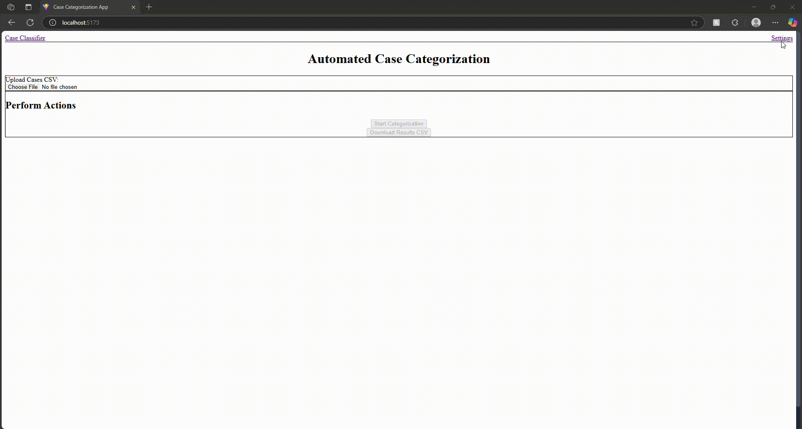

# AI-Powered Case Categorization App

Welcome to the **Case Categorization App**! This application streamlines the process of classifying customer service cases using Large Language Models (LLMs). Instead of manual categorization, you can upload a CSV file containing your case details, and the AI will automatically assign a product category, determine a resolution type, and provide reasoning with a certainty level for each case.

---

## What Does This Application Do?

In many organizations, customer service cases arrive with diverse descriptions and status updates, making consistent and efficient categorization a challenge. This application automates that crucial step.

### **Core Features:**

- **Automated Case Categorization:**  
  Leverages powerful LLMs to analyze case descriptions and status reasons to predict relevant product categories and resolution types.

- **Customizable Categorization:**  
  The LLM uses predefined lists of product categories and resolution types (fetched from the backend) to ensure consistent and controlled classification.

- **Prediction Insights:**  
  For each categorized case, the application provides a predicted category, a predicted resolution, a certainty score (*high*, *medium*, or *low*), and a concise reasoning explaining the LLM's decision.

- **Flexible LLM Integration:**  
  Supports various LLM providers, including OpenAI (GPT models), Google Gemini, and local Ollama models (e.g., Llama3), allowing you to choose the best fit for your needs and resources.

---

## CSV Data Handling

- **Easy Upload:**  
  Simply upload your customer case data in CSV format.

- **Intelligent Parsing:**  
  The app automatically recognizes key fields like `CaseNumber`, `CaseTitle`, `Description`, and `StatusReason`. Any other columns in your CSV are preserved as "extra fields."

- **Interactive Preview:**  
  See a real-time preview of your loaded CSV data before initiating the categorization process.

- **Comprehensive Export:**  
  Download a new CSV file containing all your original case data (including extra fields) alongside the LLM's predictions and reasoning.

- **Simple but User-Friendly Interface:**  
  Web interface built with React and Tailwind CSS for a smooth user experience.

> This app is a simple prototype to explore if solutions like this can actually help with automating and organizing case data.

---

## Technologies Used

### **Backend (API Server)**
- **Python 3.10+**  
- **FastAPI**  
- **LangChain** (plus langchain-openai, langchain-google-genai, langchain-community, langchain-core)  
- **Pydantic**  
- **Uvicorn**  
- **python-dotenv**  

### **Frontend (User Interface)**
- **React**
- **TypeScript**
- **Vite**
- **Tailwind CSS**
- **PapaParse**

---

## Prerequisites

- **Python 3.10 or higher**: [Download from python.org](https://www.python.org/downloads/)
- **Node.js** (LTS recommended) and **npm** or **Yarn**: [Download from nodejs.org](https://nodejs.org/)
- **An IDE/Text Editor**: (e.g. VS Code)
- **API Keys** (Optional, depending on LLM choice):
  - **OpenAI API Key:** [Get one from OpenAI Platform](https://platform.openai.com/account/api-keys)
  - **Google Gemini API Key:** [Get one from Google AI Studio](https://aistudio.google.com/app/apikey)
- **Ollama (Optional, for local LLMs):**  
  [Download from ollama.com](https://ollama.com/) and pull the desired model (e.g., `ollama pull llama3`)

---

## Getting Started (Step-by-Step)

### 1. **Clone the Repository**

```bash
git clone <repository_url>
cd <repository_name>
```

### 2. **Backend Setup**

```bash
cd backend
# a. Create a Virtual Environment
python -m venv venv

# b. Activate the Virtual Environment
# On macOS/Linux:
source venv/bin/activate
# On Windows (Command Prompt):
.
env\Scripts ctivate.bat
# On Windows (PowerShell):
.
env\Scripts\Activate.ps1

# c. Install Python Dependencies
pip install -r requirements.txt
```

**requirements.txt:**
```txt
fastapi==0.111.0
uvicorn==0.30.1
pydantic==2.7.1
python-dotenv==1.0.1
langchain-openai==0.1.14
langchain-google-genai==0.1.18
langchain-community==0.0.38
langchain-core==0.2.14
```

**d. Configure Environment Variables**  
Create a file named `.env` in your backend directory (at the same level as `main.py`):

```env
# Example .env file for backend

# If using OpenAI:
OPENAI_API_KEY="your_openai_api_key_here"

# If using Google Gemini:
GOOGLE_API_KEY="your_google_api_key_here"
```
_No entry needed for Ollama; just ensure Ollama is running locally._

**e. Run the Backend Server**
```bash
uvicorn main:app --reload
```
The backend server will run on [http://localhost:8000](http://localhost:8000).

---

### 3. **Frontend Setup**

Open a new terminal and go to your frontend directory:

```bash
cd ../frontend

# a. Install Node.js Dependencies
npm install
# OR
yarn

# b. Run the Frontend Development Server
npm run dev
# OR
yarn dev
```

The frontend app runs at [http://localhost:5173](http://localhost:5173).

---

## Using the Application

1. **Access the App:**  
   Open [http://localhost:5173](http://localhost:5173) in your browser.

2. **Configure the LLM:**  
   Choose your LLM model (OpenAI, Google Gemini, or Local Ollama) from the settings.  
   Make sure you have set up the necessary API keys or have Ollama running, with the keys configured in your `.env` file.

3. **Adjust Categories and Resolution Types:**  
   Configure and edit the product categories and resolution types, along with their descriptions, to fit your needs.

4. **Upload CSV:**  
   Return to the main page and click the "Upload Cases CSV" button to select your case data file.  
   *(A `Sample.csv` is provided in the repository for testing.)*  
   Your CSV should have columns like: `CaseNumber`, `CaseTitle`, `Description`, and `StatusReason`.

5. **Preview:**  
   See a preview of your loaded CSV data.

6. **Start Categorization:**  
   Click "Categorize Cases" to process your cases with the AI.

7. **View Results:**  
   Once processing is complete, review the "Categorization Results" table, which will display:
   - Original case details
   - Predicted category and resolution
   - Certainty
   - Reasoning

8. **Download Results:**  
   Click "Export Results to CSV" to download all your original case data, plus the AI’s predictions.




---
