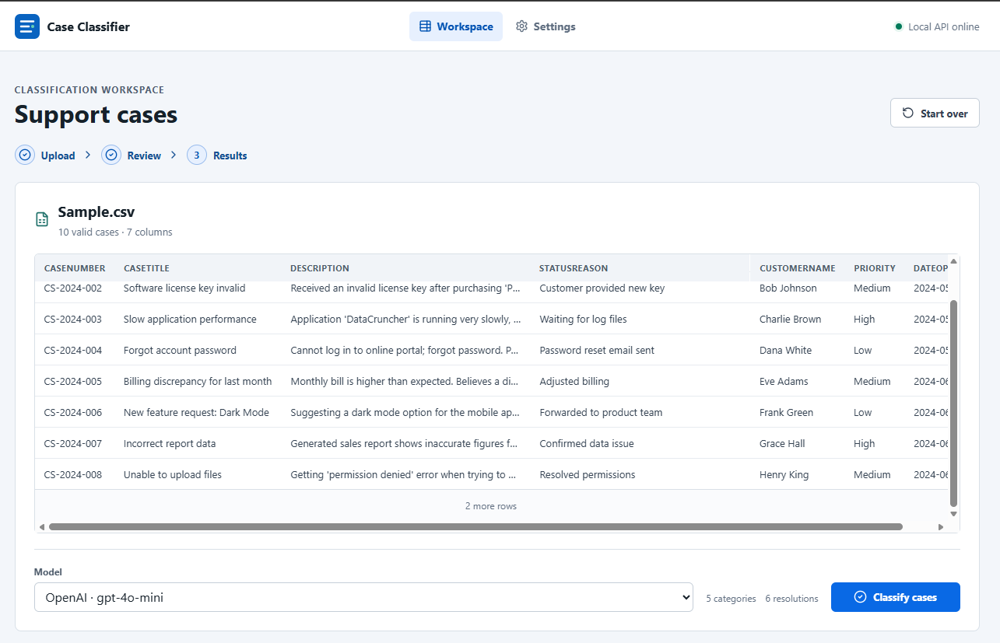
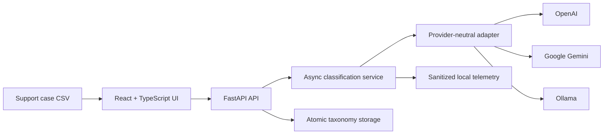

# Support Case Classifier

**A privacy-conscious AI workflow for turning support-case CSV files into consistent, reviewable classifications.**


Support Case Classifier is a local-first application that classifies customer
support cases into a configurable category and resolution taxonomy. I built it
to explore a practical question: how can an LLM help with repetitive support
operations without turning the workflow into a black box?

I wanted this to feel like a small operational tool someone could actually use,
not a demo with one text box and a model call. The result is a complete workflow
for importing cases, validating the data, reviewing model output, handling
partial failures, and exporting the enriched CSV.

<p align="center">
  
</p>

## The Problem

Support teams often receive cases in spreadsheets or exports that still need to
be categorized before they can be routed or analyzed. Doing this manually is
slow and inconsistent, but a simple LLM script introduces its own problems:

- one failed request can interrupt the whole batch;
- sequential calls make larger files unnecessarily slow;
- model responses may not match the allowed business taxonomy;
- hosted observability can expose sensitive case content;
- raw CSV identifiers and extra columns are easy to lose or corrupt.

This project treats those concerns as product requirements rather than edge
cases.

## What I Built

| Area | Implementation |
| --- | --- |
| Import workflow | Drag-and-drop CSV upload, header normalization, row validation, skipped-row feedback, and review before classification |
| Model layer | Provider-neutral adapters for OpenAI, Google Gemini, and local Ollama models |
| Reliability | Structured output validation, allowed-label enforcement, timeouts, retries, and isolated row-level errors |
| Performance | Async case processing with provider-specific concurrency limits and stable output ordering |
| Review experience | Result summaries, search, confidence/status filters, detail drawer, and complete CSV export |
| Configuration | Editable category and resolution taxonomies plus environment-based model configuration |
| Privacy | Rotating local logs and sanitized aggregate telemetry with no case text, prompts, outputs, or API keys |
| Quality | Backend API/service tests, frontend CSV regression tests, linting, formatting, and production builds |

## Product Flow

1. **Upload** a CSV and validate the required support-case fields.
2. **Review** valid rows, skipped rows, preserved columns, and the selected model.
3. **Classify** cases concurrently using a hosted or local provider.
4. **Inspect** predictions, confidence, reasoning, and row-level failures.
5. **Export** the original data with classification fields appended.

Required columns are `CaseNumber`, `CaseTitle`, `Description`, and
`StatusReason`. Header variants such as `Case Number` and `case_number` are
accepted, leading zeros are preserved, and unrelated columns remain intact.

## Architecture


```mermaid
flowchart LR
    CSV["Support case CSV"] --> UI["React + TypeScript UI"]
    UI --> API["FastAPI API"]
    API --> SERVICE["Async classification service"]
    SERVICE --> ADAPTER["Provider-neutral adapter"]
    ADAPTER --> OPENAI["OpenAI"]
    ADAPTER --> GEMINI["Google Gemini"]
    ADAPTER --> OLLAMA["Ollama"]
    SERVICE --> TELEMETRY["Sanitized local telemetry"]
    API --> TAXONOMY["Atomic taxonomy storage"]
```

The frontend owns the import, review, and results experience. FastAPI owns
configuration, taxonomy persistence, provider access, validation, concurrency,
and observability. Stable model IDs keep the UI independent from individual SDK
implementations and model names.

## Engineering Decisions

### React and FastAPI instead of Streamlit

Streamlit would have been a quick way to demonstrate a single prediction. I
kept the React and FastAPI split because this application has multi-step state,
dense tables, filters, drawers, settings, validation, and export behavior. The
separation also makes the classification service reusable outside the current
interface.

### Async, but deliberately bounded

Each case is independent, so the service uses `asyncio.gather()` to process a
batch concurrently while preserving source order. A process-wide semaphore for
each provider prevents simultaneous uploads from bypassing the configured
limits.

The defaults are conservative:

- OpenAI: 4 concurrent calls
- Google Gemini: 4 concurrent calls
- Ollama: 1 concurrent call

One timeout, malformed response, or provider failure becomes a row-level error.
It does not discard predictions that already succeeded.

### Structured outputs over free-form parsing

Every provider is adapted to the same typed prediction schema. Returned
categories and resolutions are checked against the configured taxonomy before
they reach the UI. This keeps the output useful for filtering and downstream
automation instead of accepting almost-correct labels.

### Local observability by default

The application does not send traces to LangSmith or another monitoring
platform. It writes two ignored local files under `Backend/logs/`:

- `app.log` contains rotating structured operational events;
- `telemetry.jsonl` contains one aggregate event per classification batch.

Telemetry is limited to provider/model, batch size, success and error counts,
duration, and token totals when available. It does not record case numbers,
titles, descriptions, status reasons, customer fields, prompts, model output,
or API keys.

Hosted models still receive the case fields needed for classification. Ollama
is the appropriate option when case content must remain on the local machine.

## Technology

| Layer | Tools |
| --- | --- |
| Frontend | React, TypeScript, Vite, Papa Parse, Lucide icons |
| Backend | Python, FastAPI, Pydantic, asyncio |
| Model integration | LangChain provider adapters and structured output schemas |
| Providers | OpenAI, Google Gemini, Ollama |
| Testing and quality | Pytest, Vitest, Ruff, ESLint, TypeScript |
| Developer experience | VS Code tasks, debugger configuration, environment templates |

## Run Locally

### Requirements

- Python 3.11 through 3.14
- Node.js 20 or newer
- VS Code recommended
- An API key for a hosted provider, or a running Ollama installation

### 1. Clone and install the backend

```powershell
git clone https://github.com/shshakib/support-case-classifier.git
cd support-case-classifier
python -m venv Backend\.venv
cd Backend
.\.venv\Scripts\python.exe -m pip install -e ".[dev]"
Copy-Item .env.example .env
cd ..
```

Add the providers you plan to use to `Backend/.env`:

```env
OPENAI_API_KEY=
OPENAI_MODEL=gpt-4o-mini

GOOGLE_API_KEY=
GEMINI_MODEL=gemini-2.5-flash-lite

OLLAMA_BASE_URL=http://localhost:11434
OLLAMA_MODEL=llama3
```

API keys stay in the backend and `.env` is ignored by Git. Model names,
timeouts, batch limits, and provider concurrency can be changed without editing
source code.

### 2. Install the frontend

```powershell
cd frontend
npm.cmd install
cd ..
```

`npm.cmd` is used in the examples because it also works on Windows machines
where PowerShell blocks the `npm.ps1` wrapper.

### 3. Start the application

Open the repository root in VS Code and run these tasks from
**Terminal > Run Task**:

1. `Backend: Run API`
2. `Frontend: Run App`

Then open:

- Application: [http://localhost:5173](http://localhost:5173)
- Interactive API docs: [http://127.0.0.1:8000/docs](http://127.0.0.1:8000/docs)

For backend breakpoints, choose **Run and Debug > Backend API (FastAPI)**.

The servers can also be started in separate terminals:

```powershell
cd Backend
.\.venv\Scripts\python.exe -m uvicorn app.main:app --reload --host 127.0.0.1 --port 8000
```

```powershell
cd frontend
npm.cmd run dev
```

## Verify the Project

Backend:

```powershell
cd Backend
.\.venv\Scripts\python.exe -m pytest -q
.\.venv\Scripts\python.exe -m ruff check .
.\.venv\Scripts\python.exe -m ruff format --check .
```

Frontend:

```powershell
cd frontend
npm.cmd test
npm.cmd run lint
npm.cmd run build
```

Backend classification tests use a fake asynchronous model. They verify
concurrency, stable ordering, isolated failures, and sanitized telemetry without
spending API credits or transmitting case data.

## Project Structure

```text
Backend/
  app/
    config.py          Environment configuration
    logging_config.py  Rotating structured logs
    main.py            FastAPI routes and application factory
    providers.py       Model definitions and provider adapters
    repository.py      Atomic taxonomy persistence
    schemas.py         API and model-output contracts
    service.py         Bounded async classification
    telemetry.py       Sanitized local telemetry
  data/                Taxonomy defaults and sample CSV
  tests/               API and service tests

frontend/
  src/
    api/               Typed API client
    components/        Classifier and settings screens
    utils/             CSV import and export
    App.tsx            Application shell and shared state
    types.ts           Frontend domain contracts
```

## Current Scope and Next Steps

The current version is designed for local, small-to-medium batch workflows.
Classification runs within the API request, the default maximum is 200 cases,
and classification history is not persisted.

The next meaningful additions would be:

- background jobs with progress updates for larger batches;
- explicit provider connectivity checks separate from backend health;
- a small labeled evaluation set for accuracy and prompt regression testing;
- persistent run history with role-based access for a shared deployment;
- configurable confidence thresholds and human-review queues.

These are intentionally left as product-level next steps rather than hidden
behind placeholder UI.
