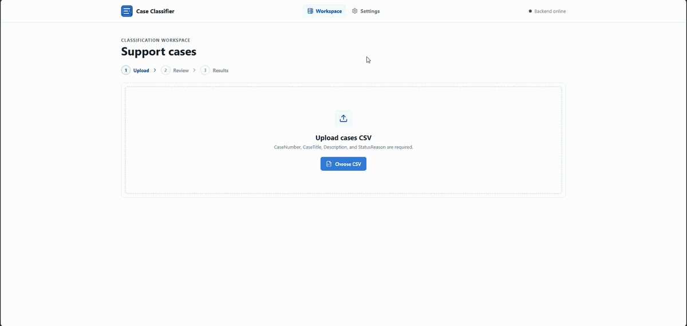
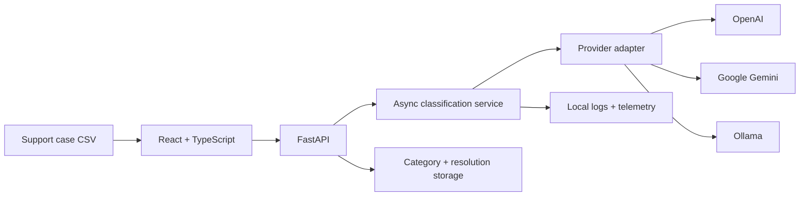

# Support Case Classifier

**An AI-assisted workspace for classifying support cases from CSV files with
configurable taxonomies, multiple model providers, and local observability.**


<p align="center">
  
</p>

<p align="center"><sub>Upload, validate, classify, review, and export support cases.</sub></p>

## Overview

Support Case Classifier turns a support-case CSV export into structured,
reviewable classifications. The application validates each row, sends valid
cases to the selected AI model, checks the response against an editable
taxonomy, and preserves the original data when exporting the results.

The interface is designed as a complete operations workflow rather than a
single-prompt demo. Users can review imported data before classification,
inspect individual predictions and reasoning, isolate failures, filter the
results, and export the enriched dataset.

## Highlights

- **Complete CSV workflow:** upload, validation, review, classification, result
  inspection, filtering, and export.
- **Multiple model providers:** OpenAI, Google Gemini, and local Ollama models
  share one provider-neutral prediction contract.
- **Configurable taxonomy:** categories and resolutions can be edited in the
  Settings screen without changing application code.
- **Reliable batch processing:** bounded asynchronous classification improves
  throughput while preserving input order and isolating row-level failures.
- **Structured predictions:** category, resolution, confidence, and reasoning
  are validated before being returned to the interface.
- **Privacy-conscious telemetry:** operational logs and aggregate metrics stay
  local and exclude case content, prompts, model responses, and API keys.

## Workflow

1. **Upload** a support-case CSV.
2. **Validate** required fields and review skipped rows.
3. **Select** any model configured on the backend.
4. **Classify** valid cases concurrently.
5. **Review** summaries, predictions, confidence, reasoning, and errors.
6. **Export** the original columns with classification fields appended.

### Try the included sample

After starting the application, upload
[`Backend/data/Sample.csv`](Backend/data/Sample.csv). The file contains ten
realistic cases covering the default category and resolution options.

Required columns:

| Column | Purpose |
| --- | --- |
| `CaseNumber` | Case identifier preserved exactly, including leading zeros |
| `CaseTitle` | Short summary displayed throughout the workspace |
| `Description` | Case details provided to the selected model |
| `StatusReason` | Current support status or action already taken |

Common header formats such as `Case Number`, `case_number`, and `CaseNumber`
are accepted. Additional columns are preserved through review and export.

## Architecture


```mermaid
flowchart LR
    CSV["Support case CSV"] --> UI["React + TypeScript"]
    UI --> API["FastAPI"]
    API --> SERVICE["Async classification service"]
    SERVICE --> ADAPTER["Provider adapter"]
    ADAPTER --> OPENAI["OpenAI"]
    ADAPTER --> GEMINI["Google Gemini"]
    ADAPTER --> OLLAMA["Ollama"]
    SERVICE --> LOGS["Local logs + telemetry"]
    API --> TAXONOMY["Category + resolution storage"]
```

| Layer | Responsibilities |
| --- | --- |
| React frontend | CSV parsing, validation feedback, workflow state, result review, and export |
| FastAPI backend | Configuration, taxonomy persistence, request validation, and API routes |
| Classification service | Concurrency limits, timeouts, stable ordering, and isolated failures |
| Provider adapters | Model creation and structured output across OpenAI, Gemini, and Ollama |
| Local observability | Rotating application logs and sanitized batch-level telemetry |

## Technology

| Area | Tools |
| --- | --- |
| Frontend | React 19, TypeScript, Vite, Papa Parse, Lucide icons |
| Backend | Python, FastAPI, Pydantic, asyncio |
| AI integration | LangChain provider adapters and structured output schemas |
| Providers | OpenAI, Google Gemini, Ollama |
| Testing | Pytest, pytest-asyncio, Vitest |
| Code quality | Ruff, ESLint, TypeScript compiler |
| Development | VS Code tasks and debugger configuration |

## Run Locally

### Requirements

- Python 3.11 through 3.14
- Node.js 20 or newer
- VS Code recommended
- An OpenAI or Google API key, or a local Ollama installation

### 1. Set up the backend

```powershell
git clone https://github.com/shshakib/support-case-classifier.git
cd support-case-classifier
python -m venv Backend\.venv
cd Backend
.\.venv\Scripts\python.exe -m pip install -e ".[dev]"
Copy-Item .env.example .env
cd ..
```

Add at least one model provider to `Backend/.env`:

```env
# OpenAI
OPENAI_API_KEY=
OPENAI_MODEL=gpt-4o-mini

# Google Gemini
GOOGLE_API_KEY=
GEMINI_MODEL=gemini-2.5-flash-lite

# Local Ollama
OLLAMA_BASE_URL=http://localhost:11434
OLLAMA_MODEL=llama3
```

Only configured providers appear in the application's model selector. API keys
remain on the backend and `.env` is ignored by Git.

### 2. Set up the frontend

```powershell
cd frontend
npm.cmd install
cd ..
```

### 3. Start both applications in VS Code

Open the repository root in VS Code, then run **Terminal > Run Task**:

1. `Backend: Run API`
2. `Frontend: Run App`

Open the application at [http://localhost:5173](http://localhost:5173).
Interactive API documentation is available at
[http://127.0.0.1:8000/docs](http://127.0.0.1:8000/docs).

For backend breakpoints, use **Run and Debug > Backend API (FastAPI)**.

### Start from terminals instead

Backend:

```powershell
cd Backend
.\.venv\Scripts\python.exe -m uvicorn app.main:app --reload --host 127.0.0.1 --port 8000
```

Frontend, in a second terminal:

```powershell
cd frontend
npm.cmd run dev
```

## Model Execution

Every provider returns the same prediction shape:

- category;
- resolution;
- confidence (`low`, `medium`, or `high`);
- short classification reasoning.

Predicted labels must match the active category and resolution taxonomy. The
service applies timeouts and provider-specific concurrency limits, then returns
results in the same order as the source CSV. A failed or malformed model
response affects only that row.

Default concurrency limits are four OpenAI requests, four Gemini requests, and
one Ollama request. They can be changed in `Backend/.env`.

## Privacy and Local Observability

The application stores operational data locally under `Backend/logs/`:

- `app.log` contains rotating structured application events;
- `telemetry.jsonl` contains one sanitized summary per classification batch.

Telemetry includes the provider, model, batch size, duration, outcome counts,
and token totals when available. It does not include case identifiers, titles,
descriptions, status reasons, customer fields, prompts, raw model output, or API
keys.

OpenAI and Gemini still receive the case fields required for classification.
Use Ollama when case content must remain entirely on the local machine.

## Tests and Quality Checks

Backend:

```powershell
cd Backend
.\.venv\Scripts\python.exe -m pytest -q
.\.venv\Scripts\python.exe -m ruff check .
.\.venv\Scripts\python.exe -m ruff format --check .
```

Frontend:

```powershell
cd frontend
npm.cmd test
npm.cmd run lint
npm.cmd run build
```

The automated tests cover API behavior, asynchronous classification, stable
ordering, isolated provider failures, telemetry sanitization, CSV parsing, and
the included demo dataset. Model-service tests use a fake asynchronous provider,
so they do not consume API credits or transmit case data.

## Project Structure

```text
Backend/
  app/
    config.py          Environment and provider configuration
    logging_config.py  Rotating structured logs
    main.py            FastAPI routes and application factory
    providers.py       Model definitions and provider adapters
    repository.py      Atomic taxonomy persistence
    schemas.py         API and prediction contracts
    service.py         Bounded asynchronous classification
    telemetry.py       Sanitized local telemetry
  data/                Default taxonomies and sample CSV
  tests/               API, service, and demo-data tests

frontend/
  src/
    api/               Typed backend client
    components/        Classification and settings screens
    utils/             CSV import and export
    App.tsx            Application shell and shared state
    types.ts           Frontend domain contracts

docs/media/            Portfolio screenshots and demo recording
.vscode/               Run, test, build, and debug configurations
```

## Scope

The application is designed for local, small-to-medium batch workflows. A
classification request supports up to 200 cases by default and completes within
the API request lifecycle. Run history, user accounts, and background job
processing are outside the current scope.
